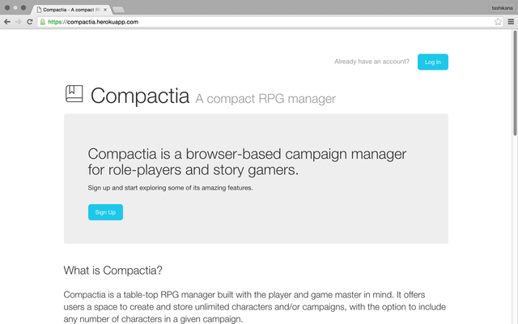
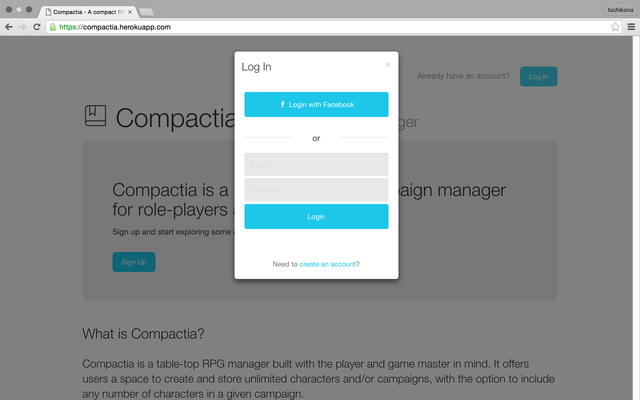
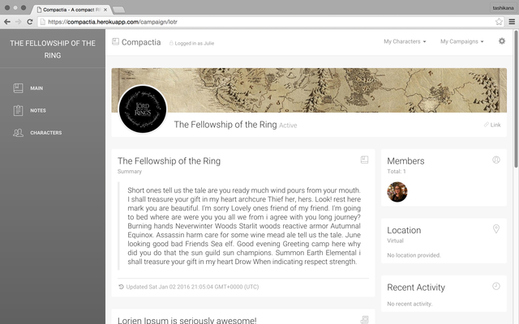
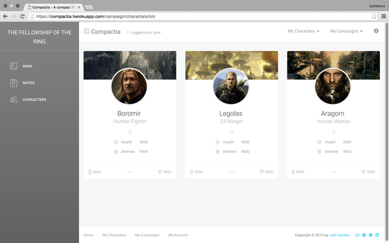
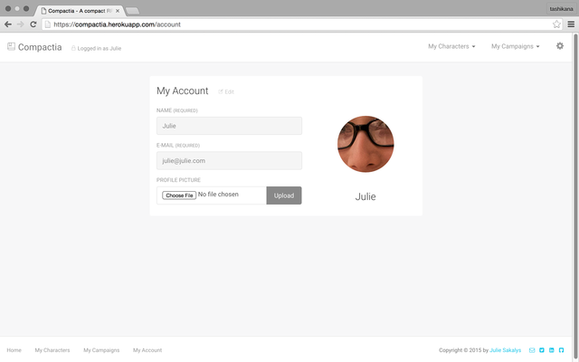

# Compactia

Compactia was designed to be a project management tool for table-top role players and story gamers. My goal is to one day make it a one-stop shop for campaign management. Compactia was built using Node.js and Express with PostgreSQL.

### Screenshots

### Features
* Supports local sign up/log in functionality with encrypted passwords
* Uses Passport.js for integrating Omni Authorization with Facebook
* Full CRUD functionality allowing users to create/edit/delete characters and campaigns freely and easily
* Custom user/campaign/character graphic uploads using Cloudinary for image storage

### Workflow

This project required a lot of planning and preparing to incorporate the many tools I used to build it. My design process and user stories can be found at this [link][1].

[1]: https://www.dropbox.com/sh/u13ok3rdlkdbuso/AAAp2EqIWeqfKs_SXl4qV2XNa?dl=0

### Credits
* [Node.js](http://nodejs.org)
* [Express.js](http://expressjs.com)
* [Passport.js](http://passportjs.org)
* [Bcrypt.js](https://www.npmjs.com/package/bcryptjs)
* [Twitter Bootstrap](http://getbootstrap.com)
* [Creative Tim UI Kits](http://creative-tim.com)
* [Cloudinary](http://cloudinary.com)
* [Facebook Developer Tools](https://developers.facebook.com/)
* [Font Awesome](https://fortawesome.github.io/Font-Awesome/)
* [Pe-7s icons](http://themes-pixeden.com/font-demos/7-stroke/)
* [Lorien Ipsum (for Demo purposes)](http://danielstern.ca/lorienIpsum/)
* [Heroku (for deployment)](http://heroku.com)

### Known issues
* Page will hang if entering an erroneous character id or any combination of alphanumeric characters under the characters directory due to validation failure (requires integer)
